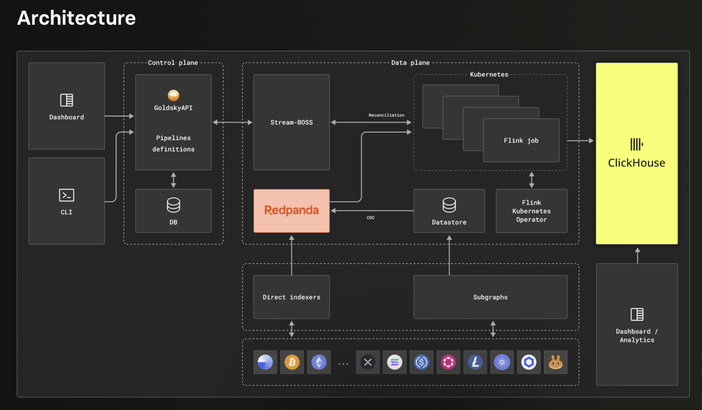

# Rethinking Our Indexation Architecture

## From PostgreSQL + Polling to Streaming + Columnar OLAP

**Goal:** Enable real-time wallet UX and simplify operations  
**Pattern:** Flink + ClickHouse (streaming + columnar)

---

# 10 Years of Blockchain Indexation

| Era | Years | Technology | Bottleneck |
|-----|-------|------------|------------|
| **Monolithic Scrapers** | 2015–2018 | Custom daemons + PostgreSQL | Vertical scaling, reorg handling |
| **Subgraph / WASM** | 2018–2021 | The Graph, AssemblyScript | Weeks-long genesis sync |
| **Data Lake** | 2021–2023 | Spark / Trino + Parquet | Minutes-to-hours latency |
| **Real-Time Streaming** | 2024–2025 | Flink + ClickHouse | Current state-of-the-art |

**The industry has moved on. We're still in the first row.**

---

# What the Industry Does Today

### Who's using streaming + columnar?

| Company | Stack | Use Case |
|---------|-------|----------|
| **Nansen** | ClickHouse Cloud | 500M+ labeled addresses, 1000x speedup vs BigQuery |
| **Goldsky** | Redpanda → Flink → ClickHouse | Powers Coinbase, Kraken — real-time wallet infra |
| **Dune (Sim)** | sim.io engine, ~200ms latency | 60+ chains, real-time multichain API |

### The pattern

```
Chain → Streaming buffer → Stream processor → Columnar DB → APIs
        (Kafka/Redpanda)    (Flink)           (ClickHouse)
```

**CDC (Change Data Capture)** for reorg-safe processing — retractions propagate automatically.

---

# Example: Goldsky Architecture



**Key components:** Redpanda → Flink (K8s) → ClickHouse  
CDC for reorg safety, subgraphs/direct indexers for chain data, analytics dashboard on top.

---

# The Challenges We Face Today

### Why PostgreSQL + polling doesn't scale

- **Nodes aren't databases:** JSON-RPC is for consensus, not queries. No index on "all txs for address X."
- **Single point of failure:** Archive nodes are expensive, hard to scale, and one node down = service down.
- **Latency:** Polling means seconds-to-minutes delay. Users expect instant feedback.
- **Reorg handling:** Manual rollback logic is error-prone and expensive to maintain.
- **Analytics:** OLTP databases choke on "give me all 2024 transactions for user Y."
- **Scaling:** Vertical (bigger Postgres) is costly; sharding is painful.
- **Ops burden:** We own every worker, every backfill, every on-call page.

---

# What "Flinkhouse" Brings

### Streaming + Columnar OLAP

```
Chain → Streaming buffer → Stream processor → Columnar DB → APIs
        (Kafka/Redpanda)    (Flink)           (ClickHouse)
```

| Aspect | Target State |
|--------|--------------|
| **Data freshness** | Sub-second (push, not poll) |
| **Reorg handling** | Changelog streams auto-retract orphaned events (CDC) |
| **Query pattern** | OLAP-optimized; fast aggregations on billions of rows |
| **Scaling** | Horizontal; append-only, 70-80% columnar compression |
| **Ops burden** | Proven pattern; less custom code to maintain |

---

# Why This Matters for Wallets

### User-facing improvements

- **Instant tx feedback:** Balance updates as blocks land, not after next poll
- **Live portfolio:** Real-time token prices × holdings across chains
- **Proactive alerts:** Push notifications on inbound funds, liquidations, NFT sales
- **Transaction enrichment:** Decode smart contracts, add labels/tags, explain "what happened"
- **Cross-chain grouping:** Unified view of bridged assets, related txs across L1/L2s

### Internal / product improvements

- **Fast analytics:** ClickHouse handles "all txs for user X in 2024" in milliseconds
- **Simpler multi-chain:** Same streaming pattern scales to new chains
- **Better debugging:** Replay events from the log; deterministic reprocessing

---

# Cost & Simplicity Comparison

| Dimension | PostgreSQL + Polling | Flink + ClickHouse |
|-----------|---------------------|-------------------|
| **Infra cost** | Archive nodes + large Postgres | Streaming buffer + columnar (70-80% compression) |
| **Engineering time** | Custom workers, reorg logic, backfills | Declarative pipelines, CDC built-in |
| **Query cost** | Full table scans | Columnar skipping; only touch relevant columns |
| **Scaling cost** | Vertical = expensive | Horizontal append-only; predictable |

**Bottom line:** Trade custom plumbing for a proven pattern that's cheaper to run and easier to extend.

---

# What Use Cases This Unlocks

| Use Case | Today | With Streaming + OLAP |
|----------|-------|----------------------|
| **Real-time balances** | Poll every N seconds | Push on every block |
| **Tx history for power users** | Slow queries, pagination hacks | Sub-second aggregations |
| **Cross-chain portfolio** | Separate DBs, manual stitching | Unified streaming + single query layer |
| **Fraud / velocity checks** | Batch jobs, delayed detection | Streaming rules, instant signals |
| **Analytics dashboards** | Overload prod DB or separate ETL | ClickHouse handles analytics natively |
